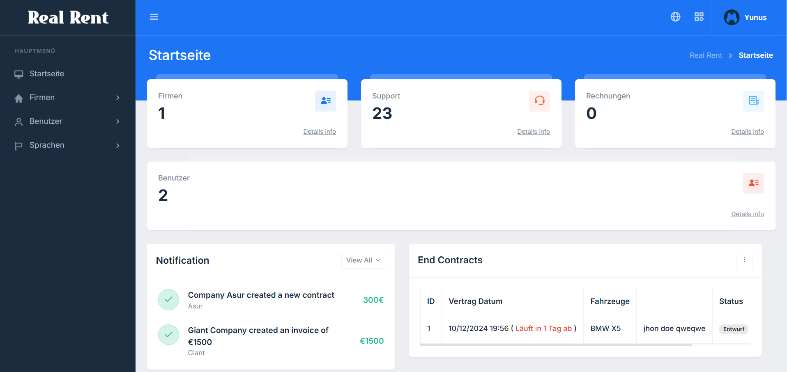
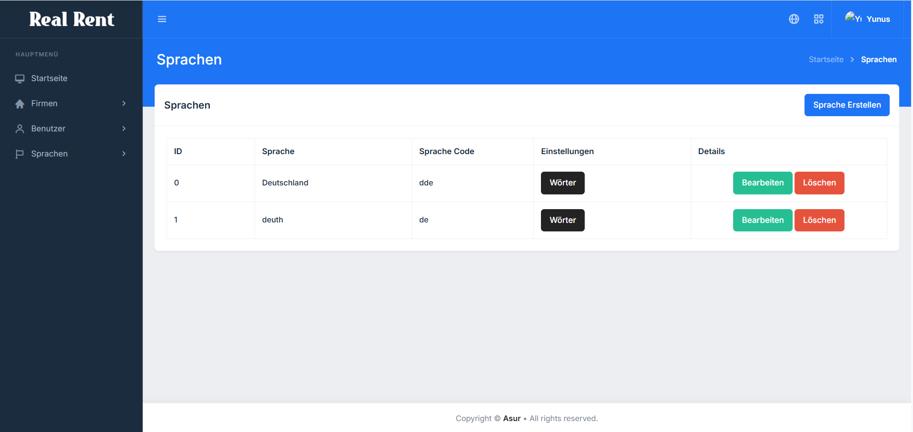

## Company Dashboard

Dashboard used by companies with more than one company module. You can access all the links in the dashboard from the side menu. You can use all the modules required for vehicle management, customer management, contract management and car rental companies from this panel.

  
  

## Super Admin Dashboard

Super Admin control panel: from this panel you can manage multi-language management, multi-company management, multi-user management, multi-role and permission management and software settings.

  
  

## Modules

- Multi Company Module.
- Multi User Module.
- Multi Roles and Permissions Module.
- Multi Language Module.
- Bulk Emailler Module.
- Stripe Payment Module.
- Calender Module
- Reservation Module
- Customer Management Module
- Invoices Module

## Requirements

- PHP 8.0 or above
- Composer

## Contribute

1. Fork this project.
2. Create a new feature branch (`feature/feature-adi`).
3. Commit your changes (`git commit -m 'New feature added'`).
4. Push the branch to master (`git push origin feature/feature-adi`).
5. Open a Pull Request.

## Licence
This project is licensed under the [MIT License](LICENSE).
