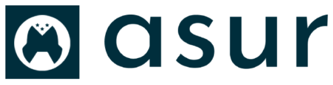

## Company Dashboard

Dashboard used by companies with multiple company modules. You can access all links on the dashboard from the side menu.

  
  

## Super Admin Dashboard

super admin control panel: from this panel you can manage multi-language management, multi-company management, multi-user management, multi-role and permission management and software settings.

  

## Modules

- [Simple, fast routing engine](https://laravel.com/docs/routing).
- [Powerful dependency injection container](https://laravel.com/docs/container).
- Multiple back-ends for [session](https://laravel.com/docs/session) and [cache](https://laravel.com/docs/cache) storage.
- Expressive, intuitive [database ORM](https://laravel.com/docs/eloquent).
- Database agnostic [schema migrations](https://laravel.com/docs/migrations).
- [Robust background job processing](https://laravel.com/docs/queues).
- [Real-time event broadcasting](https://laravel.com/docs/broadcasting).
